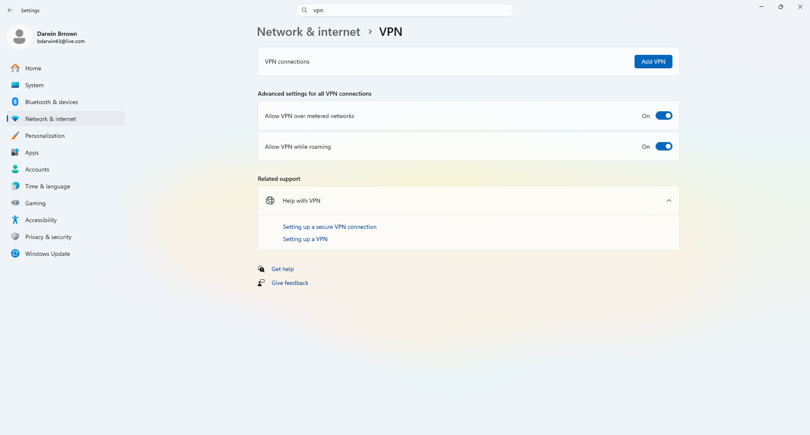
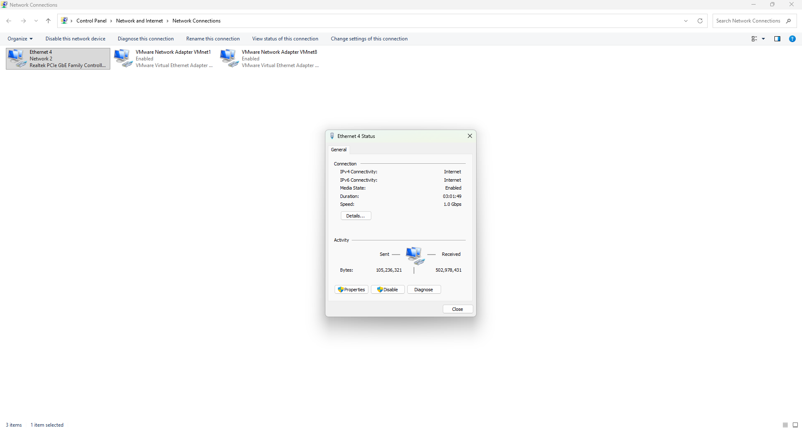
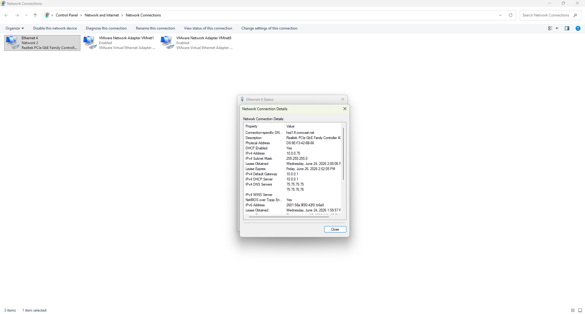
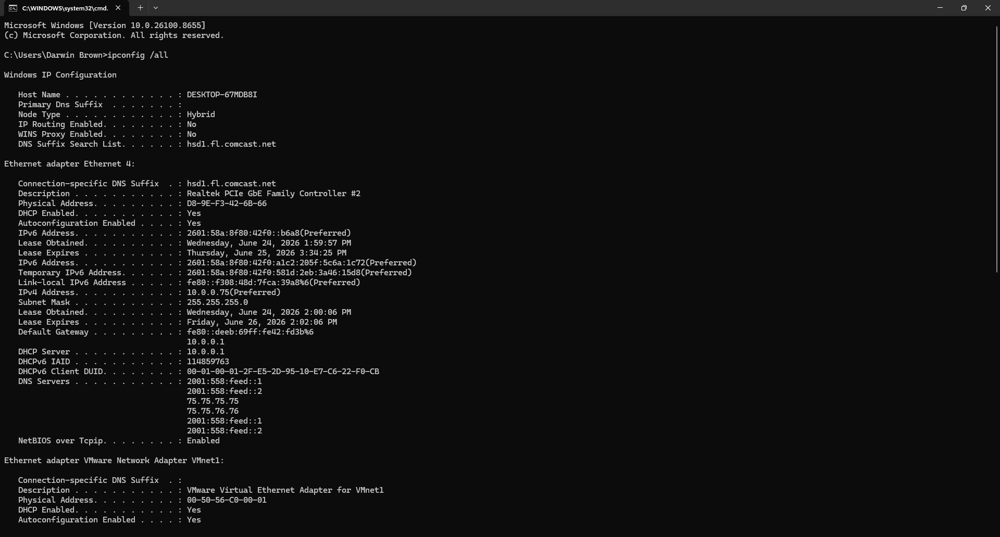
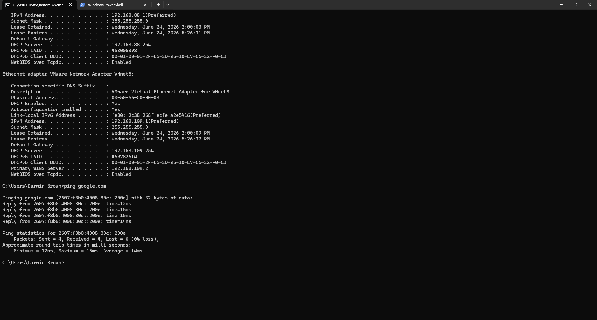
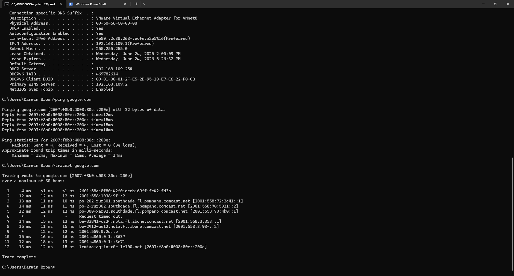
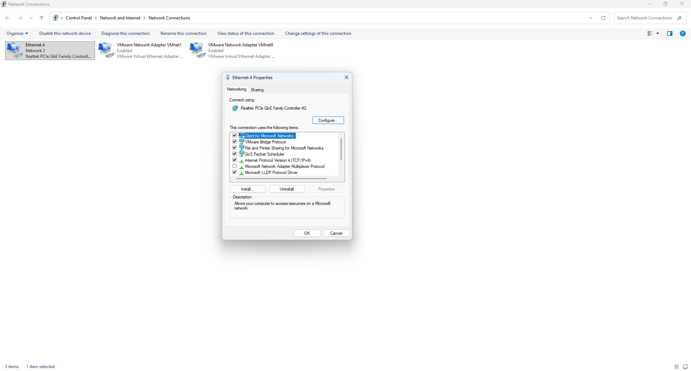

# Darwin VPN Troubleshooting Lab

## Overview

This project demonstrates a common Windows 11 Help Desk troubleshooting scenario involving VPN connection issues.

The lab walks through identifying VPN connectivity problems, testing network connectivity, verifying DNS resolution, checking ports, and documenting the troubleshooting process using built-in Windows tools.

---

## Skills Demonstrated

- Windows 11 Administration
- Help Desk Troubleshooting
- VPN Troubleshooting
- Network Diagnostics
- DNS Troubleshooting
- Command Prompt
- PowerShell
- Customer Support Documentation

---

## Tools Used

- Windows 11
- VPN Settings
- Command Prompt
- Windows PowerShell
- Network Connections
- Task Manager

---

## Troubleshooting Steps

### 1. Verify Internet Connection

Confirmed the computer has internet access before testing VPN connectivity.

---

### 2. Review VPN Settings

Verified VPN server address, username, authentication method, and connection settings.

---

### 3. Check IP Configuration

Used **ipconfig /all** to verify adapter configuration.

---

### 4. Test Network Connectivity

Used **ping** to verify communication with public hosts.

---

### 5. Trace Network Route

Used **tracert** to identify possible routing problems.

---

### 6. Verify DNS Resolution

Used **nslookup** to confirm DNS was functioning correctly.

---

### 7. Test VPN Port Connectivity

Used PowerShell **Test-NetConnection** to verify VPN port accessibility.

---

### 8. Document Resolution

Recorded troubleshooting steps and final resolution.

---

## Screenshots

### 1. VPN Settings

Reviewed Windows VPN configuration.

---

### 2. Network Connections

Verified active network adapters.

---

### 3. Ethernet Status

Verified the active Ethernet connection and network status.

---

### 4. Network Details

Reviewed IP address, DNS, gateway, and DHCP information.

---

### 5. IP Configuration

Verified adapter information using `ipconfig /all`.

---

### 6. Ping Test

Verified internet connectivity using `ping google.com`.

---

### 7. Tracert

Analyzed the network route using `tracert google.com`.

---

### 8. Ethernet Properties

Reviewed installed networking protocols and adapter settings.

### 8. Resolution Summary

Final troubleshooting documentation.

